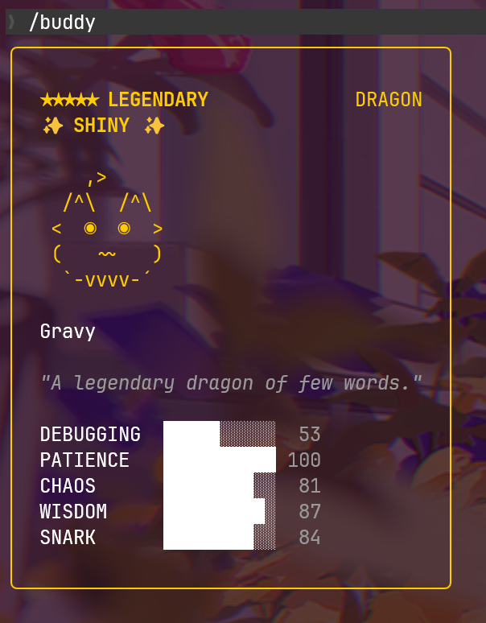

# 🐾 Awesome Claude Code Buddies

<div align="center">


**🦄 本仓库收集了大量稀有 Claude Code Buddy 的 UserID！**



</div>

---

## 🎯 这是什么？

Claude Code 有一个 `/buddy` 功能，可以领养一只专属小宠物。每个 UserID 对应一个固定的宠物，包括物种、稀有度、眼睛、帽子、属性等。

本仓库收集了**预先计算好的稀有宠物 UserID**，让你不用再跑几百万次随机！

---

## 📚 教程来源

本仓库的脚本和方法来自于：[Claude Code /buddy 宠物系统逆向分析 —— 如何重置并刷到你想要的宠物 - 开发调优 - LINUX DO](https://linux.do/t/topic/1871870)

---

## ✨ 特性

- 🏆 **Legendary** 传说稀有度的宠物 UserID
- ✨ **Shiny** 闪光宠物
- 🎩 各种稀有帽子 (crown, tophat, halo, wizard...)
- 📊 满属性宠物

---

## 📁 目录结构

按物种分类存放在 `buddies/` 文件夹中：

```
buddies/
├── dragon/          # 🐉 龙
├── cat/             # 🐱 猫
├── duck/            # 🦆 鸭子
├── owl/             # 🦉 猫头鹰
├── capybara/        # 🦫 水豚
├── axolotl/         # 🦎 蝾螈
├── ghost/           # 👻 幽灵
├── mushroom/        # 🍄 蘑菇
├── robot/           # 🤖 机器人
├── rabbit/          # 🐰 兔子
├── penguin/         # 🐧 企鹅
├── turtle/          # 🐢 乌龟
├── octopus/         # 🐙 章鱼
├── snail/           # 🐌 蜗牛
├── blob/            # 🫧 团子
├── goose/           # 🪿 鹅
├── chonk/           # 🐷 胖胖
└── cactus/          # 🌵 仙人掌
```

每个文件夹内的 `.md` 文件包含 UserID 和对应的宠物属性。

---

## 🛠️ 使用方法

### 方法一：直接使用收集的 UserID

1. 在 `buddies/` 中找到你想要的宠物物种文件夹
2. 打开对应的 `.md` 文件
3. 复制 UserID
4. 将 `~/.claude.json` 中的 `userID` 字段改为对应的值

### 方法二：使用脚本自己搜索

本仓库提供了搜索脚本 `buddy-reroll.js`：

```bash
# 使用 Bun (推荐，结果与 Claude Code 一致)
bun buddy-reroll.js --species dragon --rarity legendary --shiny

# 使用 Node (结果可能不一致)
node buddy-reroll.js --species cat --rarity epic

# 查看某个 UserID 对应的宠物
bun buddy-reroll.js --check <your-userid>
```

更多选项请运行 `bun buddy-reroll.js --help`

---

## 🤝 贡献

欢迎提交 PR 分享你找到的稀有宠物 UserID！

---

## ⚖️ License

MIT
